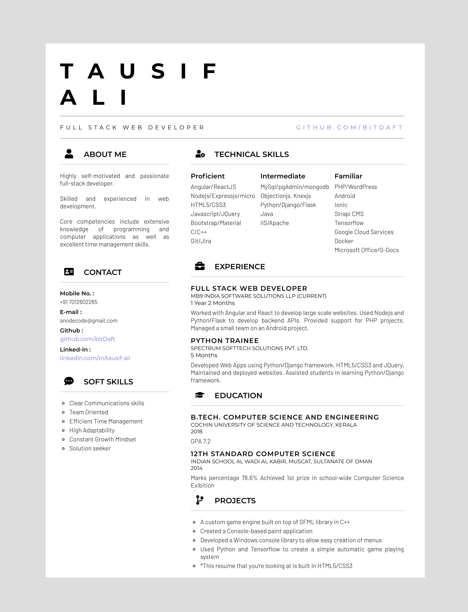

# Resume Template Clean

A clean and elegant template for resume.
 
# Steps to save resume as pdf
    
Open `index.html` in Google chrome  
Select Print of Website  
Change `Destination` to `Save as PDF`  
Set `Pages` to `Custom` and set page count to 1  
Under `More settings` Change `Paper size` to `A4`  
Set `Margins` to `None`  

# Screenshot

